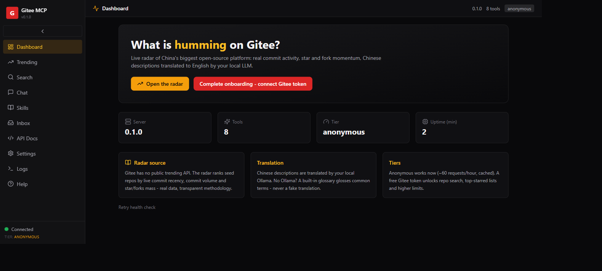

<p align="center">
  
</p>

<h1 align="center">gitee-mcp</h1>

<p align="center"><b>See what is humming in the Chinese open-source world.</b><br />
An MCP server and dark-theme webapp that bridge AI assistants to <b>Gitee</b> -
China's largest GitHub-style platform - with a live activity radar, repo intel,
search, zh->en translation and ecosystem intelligence.</p>

<p align="center">
  <a href="LICENSE"></a>
  <a href="#requirements"></a>
  <a href="docs/ARCHITECTURE.md"></a>
  <a href="docs/CONFIGURATION.md"></a>
  <a href="INSTALL.md"></a>
  <a href="docs/ARCHITECTURE.md"></a>
</p>

<p align="center">
  <a href="#quick-install"><b>Quick install</b></a> ·
  <a href="#example-prompts">Example prompts</a> ·
  <a href="#documentation">Documentation</a>
</p>

---

Works with any MCP host (Claude Desktop, Cursor, opencode) and ships a
dark-theme webapp on ports 11161/11162. **Anonymous mode works out of the box** -
no account, no credit card, real data. A free Gitee token unlocks repo search
and top lists.

## What this wraps

**Gitee** is the biggest Chinese-language code hosting platform (12M+
users, home of OpenHarmony, dromara/hutool, macrozheng/mall and much of
China's OSS). Its ecosystem is nearly invisible from Western tooling, and
its API is rate-limited and partially token-gated. gitee-mcp bridges it:
anonymous mode works out of the box, a free token unlocks full search.
See [docs/WRAPPEE.md](docs/WRAPPEE.md) for the full picture.

## Features

- **Humming radar** - a live, ranked view of what is active on Gitee,
  computed from real commit/star/fork data. Gitee has no public trending
  API; the radar is our transparent methodology, not a simulation.
- **Momentum** - every radar build persists history, so you can watch
  `momentum`, `momentum_7d` and `surge` climb as repos heat up, and read a
  weekly "who's rising" digest.
- **Repo intel** - details, README, language mix, recent commits, file tree,
  branches, a Chinese-OSS tech-stack fingerprint, release notes and observed
  star history for any public repo.
- **Search** - users anonymously; repos with a free token. Queries are
  cross-lingual: "low-code" also finds 低代码.
- **Translation** - Chinese descriptions, issues and commits to English via
  your local Ollama (honest dictionary-gloss fallback when no model runs).
- **Webhooks & watchlist** - push/star/fork events, plus a persistent
  watchlist with change detection and auto-follow thresholds.
- **Ecosystem** - org/fork-family graphs, GitHub mirror comparison, a README
  keyword corpus (BM25, RAG-lite) and an RSS feed of the radar.
- **Webapp** - dark-theme dashboard for all of the above on 11161/11162.

## Quick Install

**Option A - drag and drop (Claude Desktop):** download
`gitee-mcp-v0.2.0.mcpb` from
[Releases](https://github.com/sandraschi/gitee-mcp/releases/latest) and
drag it onto Claude Desktop. Works immediately in anonymous mode.

**Option C - manual:**

```bash
git clone https://github.com/sandraschi/gitee-mcp
cd gitee-mcp && uv sync
```

Add to `claude_desktop_config.json`:

```json
{
  "mcpServers": {
    "gitee-mcp": {
      "command": "uv",
      "args": ["--directory", "C:\\path\\to\\gitee-mcp", "run", "python", "-m", "gitee_mcp.server"]
    }
  }
}
```

All methods: [INSTALL.md](INSTALL.md).

> **First time?** Complete [docs/ONBOARDING.md](docs/ONBOARDING.md) to
> create a free Gitee token (optional but unlocks repo search).

## Example Prompts

- "What is humming on Gitee right now?"
- "Show me the 10 most active Python repos on Gitee, translated to English."
- "Profile dromara/hutool and summarize its README."
- "Search Gitee for users named macrozheng."
- "Translate this to English: 企业级微服务快速开发框架"

## Documentation

| Doc | Contents |
|-----|----------|
| [Installation](INSTALL.md) | All install methods (A-D), prerequisites |
| [Onboarding](docs/ONBOARDING.md) | Free Gitee token, tier comparison, pitfalls |
| [Wrapped platform](docs/WRAPPEE.md) | Gitee overview, API quirks, community links |
| [Architecture](docs/ARCHITECTURE.md) | Dual transport, REST surface, caching, ecosystem layer, ports |
| [Configuration](docs/CONFIGURATION.md) | All env vars, local data stores |
| [Tool Reference](docs/TOOLS.md) | Every tool and operation |
| [Development](docs/DEVELOPMENT.md) | Dev setup, tests, contributing |
| [Troubleshooting](docs/TROUBLESHOOTING.md) | Common issues and fixes |
| [Feature Spec](SPEC.md) | v0.2 ecosystem-intelligence spec (tiers, deferred) |

## Requirements

- Python 3.11+ (via `uv`)
- Claude Desktop or any MCP host
- Optional: Ollama (`winget install Ollama.Ollama`, `ollama pull qwen2.5:7b`)
  for translation
- Optional: free Gitee token for repo search

## Stack

| Layer | Tech |
|-------|------|
| Backend | Python 3.11, FastMCP 3.4.4+ (MCP), FastAPI (REST), uvicorn, httpx, beautifulsoup4, Pydantic v2 |
| Frontend | React 18, Vite 5, TypeScript, Tailwind CSS (dark), Zustand, Lucide, Framer Motion, react-router-dom, react-markdown |
| Tooling | uv, just, ruff, pyright, pytest (+ pytest-cov, respx), Bun, Biome, Playwright |
| Local LLM | Ollama (OpenAI-compatible `/v1`), default `qwen2.5:7b` |

## License

MIT
